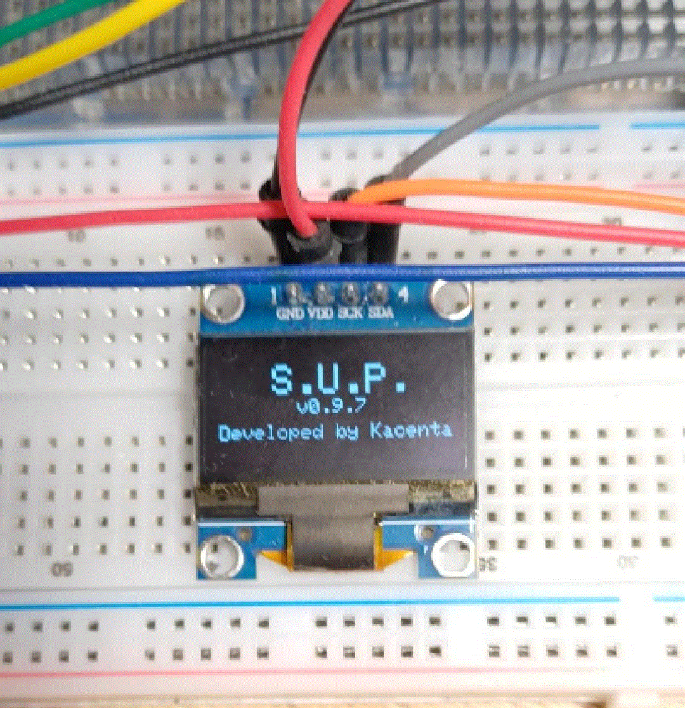
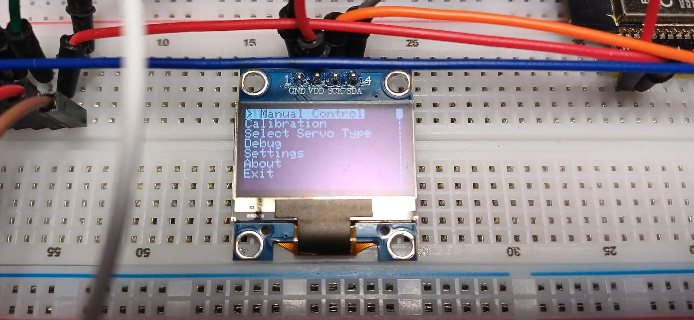
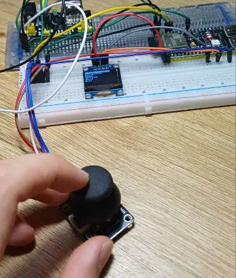
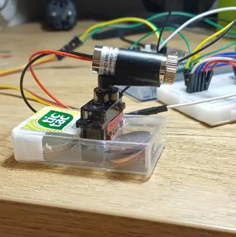

# Servo-Utility-Platform (SUP)

A (kinda) compact **ESP32-based tool** for setting up **servos** for your **Robotics Projects**

## Overview

The Servo-Utility-Platform (a.k.a **SUP**) **serv(o)s** as a useful tool for both engineers and hobbyists with its main focus aimed towards **testing**, **calibrating** and **(coming soon)** ~~**running diagnostics**~~ on servo motors - the backbone of a considerable amount of **Robotics** and **Engineering** projects.



## DEMO


## Features

- **Manual Servo Control**
- **Servo Sweeps** tests the full range of servo movement
- **Pulse-Width Calibration**
- **C.E.A. Laser Calibration** - fixes servos with using a laser module
- **Support for multiple Servo Types**, including positional **(90°, 180°)** and continuous-rotation **(360°)** servos
- **Joystick Calibration**
- **Persistent Calibration Profiles** with 6 save slots stored in the ESP32's non-volatile memory
- **Configurable Controls and Settings**, including joystick axis inversion, axis swapping, speed multipliers, and delay settings
- **Debug Menu** for testing features and error handling
- **OLED interface** with menus, visual feedback, and animations  



## Hardware Used

- **ESP32-S3** - *x1*
- Small *I2C OLED* **128x64 display** - *x1*
- **Joystick modules** - *x1*
- **Servo modules** *(MG90) - x1*
- **Servo modules** *(MG90s) - x1-2*  
- *830-point* **breadboard** - *x2*
- Jumper and Dupont **wires** - *~25 max*  

<table>
  <tr>
    <td></td>
    <td></td>
  </tr>
</table>

## Repo Structure

```text
/docs
  /devlogs
  /images
  design.md
  journal.md
  TODO.md

/firmware
  /ServoUtilityPlatform
    ServoUtilityPlatform.ino

/working-tests
  /LED-Test
  /Serial-Debuffer
  ...

/hardware
  parts.md
  wiring.md
```

- **/firmware**  
  stores the **Arduino IDE sketch**

- **/hardware**  
   stores **wiring information** and **parts list**

- **/docs**  
  a custom **journal** to help me (because I forget things) and you too, i guess. You could **follow the project** progress from there

## Project Roadmap

- [x] Project planning
- [x] Repository setup
- [x] Basic servo control
- [x] OLED interface
- [x] Menu system
- [x] Calibration
- [x] Documentation
- [x] Actually TEST the calibration workflow and check if it really works with a real servo
- [x] Add an X-axis animation to the Settings menu when changing variables
- [x] Add Pulse-Width Calibration
- [x] Add Working Settings Menu
- ~~[ ] Add a way to name list slots~~
- ~~[ ] Make list slots dynamically generated instead of hardcoded~~
- - ~~[ ] Add an "add/make new slot" option~~
- ~~[ ] Make an on-screen keyboard or use a library~~
- [x] Add "About" as a menu option
- [x] Final Polish
- [x] Film Demo Montage
- [x] First release

## Current Status

First release will be **coming soon**!

## Licence

MIT License.
